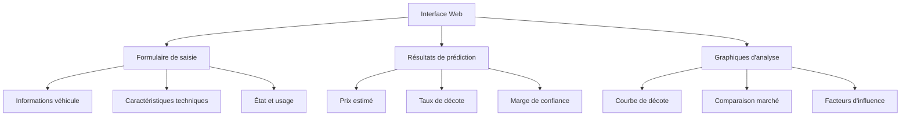

# Interface utilisateur

## Vue d'ensemble

L'application web **Valeur Résiduelle** propose une interface développée avec **Dash** pour permettre aux utilisateurs d'estimer la valeur de leur véhicule d'occasion.

## Architecture de l'interface (cible)



## Composants principaux

### 1. Formulaire de saisie

```python
import dash
from dash import dcc, html, Input, Output, State
import dash_bootstrap_components as dbc

# Layout du formulaire principal
def create_input_form():
    return dbc.Container([
        dbc.Row([
            dbc.Col([
                html.H3("Informations du véhicule", className="mb-3"),
                
                # Marque
                dbc.Label("Marque"),
                dcc.Dropdown(
                    id='marque-dropdown',
                    options=[
                        {'label': 'BMW', 'value': 'BMW'},
                        {'label': 'Mercedes', 'value': 'Mercedes'},
                        {'label': 'Audi', 'value': 'Audi'},
                        {'label': 'Volkswagen', 'value': 'Volkswagen'},
                        {'label': 'Renault', 'value': 'Renault'},
                        {'label': 'Peugeot', 'value': 'Peugeot'},
                        # ... autres marques
                    ],
                    placeholder="Sélectionnez une marque",
                    className="mb-3"
                ),
                
                # Modèle (dépendant de la marque)
                dbc.Label("Modèle"),
                dcc.Dropdown(
                    id='modele-dropdown',
                    placeholder="Sélectionnez d'abord une marque",
                    className="mb-3"
                ),
                
            ], width=6),
            
            dbc.Col([
                html.H3("Caractéristiques", className="mb-3"),
                
                # Année
                dbc.Label("Année de mise en circulation"),
                dcc.Dropdown(
                    id='annee-dropdown',
                    options=[{'label': str(year), 'value': year} 
                            for year in range(2024, 2016, -1)],
                    placeholder="Année",
                    className="mb-3"
                ),
                
                # Kilométrage
                dbc.Label("Kilométrage (km)"),
                dbc.Input(
                    id='kilometrage-input',
                    type='number',
                    min=0,
                    max=300000,
                    step=1000,
                    placeholder="Ex: 45000",
                    className="mb-3"
                ),
                
            ], width=6)
        ]),
        
        dbc.Row([
            dbc.Col([
                # Carburant
                dbc.Label("Type de carburant"),
                dcc.RadioItems(
                    id='carburant-radio',
                    options=[
                        {'label': ' Essence', 'value': 'Essence'},
                        {'label': ' Diesel', 'value': 'Diesel'},
                        {'label': ' Hybride', 'value': 'Hybride'},
                        {'label': ' Électrique', 'value': 'Electrique'}
                    ],
                    className="mb-3"
                ),
                
                # Transmission
                dbc.Label("Transmission"),
                dcc.RadioItems(
                    id='transmission-radio',
                    options=[
                        {'label': ' Manuelle', 'value': 'Manuelle'},
                        {'label': ' Automatique', 'value': 'Automatique'}
                    ],
                    className="mb-3"
                ),
                
            ], width=6),
            
            dbc.Col([
                # Puissance
                dbc.Label("Puissance (CV)"),
                dbc.Input(
                    id='puissance-input',
                    type='number',
                    min=50,
                    max=600,
                    step=5,
                    placeholder="Ex: 150",
                    className="mb-3"
                ),
                
                # Bouton de calcul
                dbc.Button(
                    "Estimer la valeur",
                    id="estimate-button",
                    color="primary",
                    size="lg",
                    className="mt-4 w-100"
                ),
                
            ], width=6)
        ])
    ])
```

### 2. Affichage des résultats

```python
def create_results_section():
    return dbc.Container([
        html.Div(id="results-container", children=[
            dbc.Alert(
                "Veuillez remplir le formulaire et cliquer sur 'Estimer la valeur'",
                color="info",
                className="text-center"
            )
        ])
    ])

def create_result_cards(estimation_data):
    """Création des cartes de résultats"""
    
    return dbc.Row([
        # Prix estimé
        dbc.Col([
            dbc.Card([
                dbc.CardBody([
                    html.H4("Prix estimé", className="card-title"),
                    html.H2(f"{estimation_data['prix_estime']:,.0f} €", 
                            className="text-primary"),
                    html.P(f"Marge: ±{estimation_data['marge']:.0f} €",
                           className="text-muted")
                ])
            ], className="h-100")
        ], width=4),
        
        # Taux de décote
        dbc.Col([
            dbc.Card([
                dbc.CardBody([
                    html.H4("Taux de décote", className="card-title"),
                    html.H2(f"{estimation_data['taux_decote']:.1%}", 
                            className="text-warning"),
                    html.P(f"Prix neuf: {estimation_data['prix_neuf']:,.0f} €",
                           className="text-muted")
                ])
            ], className="h-100")
        ], width=4),
        
        # Confiance
        dbc.Col([
            dbc.Card([
                dbc.CardBody([
                    html.H4("Confiance", className="card-title"),
                    html.H2(f"{estimation_data['confiance']:.0%}", 
                            className="text-success"),
                    html.P("Basé sur 15,000+ véhicules",
                           className="text-muted")
                ])
            ], className="h-100")
        ], width=4)
    ], className="mb-4")
```

## Visualisations interactives

### 1. Courbe de décote

```python
import plotly.graph_objects as go
import plotly.express as px

def create_depreciation_curve(car_data):
    """Graphique de la courbe de décote dans le temps"""
    
    # Simulation de l'évolution de la valeur
    years = list(range(car_data['annee'], 2025))
    values = []
    
    for year in years:
        age = year - car_data['annee']
        # Modèle de décote empirique
        depreciation_rate = 0.15 * age + 0.05 * age**1.2
        current_value = car_data['prix_neuf'] * (1 - depreciation_rate)
        values.append(max(current_value, car_data['prix_neuf'] * 0.1))
    
    fig = go.Figure()
    
    # Courbe de décote
    fig.add_trace(go.Scatter(
        x=years,
        y=values,
        mode='lines+markers',
        name='Valeur estimée',
        line=dict(color='blue', width=3),
        marker=dict(size=8)
    ))
    
    # Point actuel
    current_year = 2024
    current_value = car_data['prix_estime']
    fig.add_trace(go.Scatter(
        x=[current_year],
        y=[current_value],
        mode='markers',
        name='Valeur actuelle',
        marker=dict(color='red', size=15, symbol='diamond')
    ))
    
    fig.update_layout(
        title="Évolution de la valeur dans le temps",
        xaxis_title="Année",
        yaxis_title="Valeur (€)",
        hovermode='x unified',
        template='plotly_white'
    )
    
    return fig
```

### 2. Comparaison avec le marché

```python
def create_market_comparison(car_data, market_data):
    """Graphique de comparaison avec le marché"""
    
    fig = go.Figure()
    
    # Distribution des prix du marché pour des véhicules similaires
    fig.add_trace(go.Histogram(
        x=market_data['prix'],
        name='Marché',
        opacity=0.7,
        nbinsx=20,
        marker_color='lightblue'
    ))
    
    # Votre estimation
    fig.add_vline(
        x=car_data['prix_estime'],
        line_dash="dash",
        line_color="red",
        annotation_text=f"Votre véhicule: {car_data['prix_estime']:,.0f}€"
    )
    
    fig.update_layout(
        title="Position par rapport au marché",
        xaxis_title="Prix (€)",
        yaxis_title="Nombre de véhicules",
        template='plotly_white'
    )
    
    return fig
```


## Fonctionnalités avancées

### 1. Mode comparaison

```python
@app.callback(
    Output('comparison-results', 'children'),
    [Input('compare-button', 'n_clicks')],
    [State('car1-data', 'data'),
     State('car2-data', 'data')]
)
def compare_vehicles(n_clicks, car1_data, car2_data):
    if not n_clicks or not car1_data or not car2_data:
        return "Ajoutez deux véhicules pour les comparer"
    
    # Comparaison côte à côte
    comparison_table = dbc.Table([
        html.Thead([
            html.Tr([
                html.Th("Caractéristique"),
                html.Th("Véhicule 1"),
                html.Th("Véhicule 2"),
                html.Th("Différence")
            ])
        ]),
        html.Tbody([
            html.Tr([
                html.Td("Prix estimé"),
                html.Td(f"{car1_data['prix_estime']:,.0f} €"),
                html.Td(f"{car2_data['prix_estime']:,.0f} €"),
                html.Td(f"{car2_data['prix_estime'] - car1_data['prix_estime']:+,.0f} €")
            ]),
            html.Tr([
                html.Td("Taux de décote"),
                html.Td(f"{car1_data['taux_decote']:.1%}"),
                html.Td(f"{car2_data['taux_decote']:.1%}"),
                html.Td(f"{car2_data['taux_decote'] - car1_data['taux_decote']:+.1%}")
            ])
        ])
    ], striped=True, bordered=True, hover=True)
    
    return comparison_table
```

### 2. Historique des recherches

```python
def save_search_history(user_session, car_data, estimation):
    """Sauvegarde de l'historique des recherches"""
    
    search_entry = {
        'timestamp': datetime.now().isoformat(),
        'car_data': car_data,
        'estimation': estimation,
        'user_session': user_session
    }
    
    # Sauvegarde en base de données
    # (implémentation selon votre système de persistence)
    
    return search_entry

def display_search_history(user_session):
    """Affichage de l'historique"""
    
    # Récupération des recherches précédentes
    history = get_user_search_history(user_session)
    
    if not history:
        return dbc.Alert("Aucune recherche précédente", color="info")
    
    history_cards = []
    for search in history[-5:]:  # 5 dernières recherches
        card = dbc.Card([
            dbc.CardBody([
                html.H6(f"{search['car_data']['marque']} {search['car_data']['modele']}"),
                html.P(f"Prix estimé: {search['estimation']['prix_estime']:,.0f} €"),
                html.Small(f"Le {search['timestamp'][:10]}", className="text-muted")
            ])
        ], className="mb-2")
        history_cards.append(card)
    
    return html.Div(history_cards)
```

## Responsive design

### Configuration Bootstrap

```python
# Thème Bootstrap personnalisé
app = dash.Dash(__name__, 
                external_stylesheets=[dbc.themes.BOOTSTRAP],
                meta_tags=[
                    {"name": "viewport", 
                     "content": "width=device-width, initial-scale=1"}
                ])

# CSS personnalisé
app.index_string = '''
<!DOCTYPE html>
<html>
    <head>
        
        <title>Valeur Résiduelle - Estimation véhicules</title>
        
        
        <style>
            .card {
                box-shadow: 0 4px 6px rgba(0, 0, 0, 0.1);
                border: none;
                border-radius: 10px;
            }
            .btn-primary {
                background: linear-gradient(45deg, #007bff, #0056b3);
                border: none;
            }
            .navbar-brand {
                font-weight: bold;
                color: #007bff !important;
            }
        </style>
    </head>
    <body>
        
        
        
        
    </body>
</html>
'''
```

## Gestion des erreurs et validation

### Validation des entrées

```python
@app.callback(
    [Output('estimate-button', 'disabled'),
     Output('validation-feedback', 'children')],
    [Input('marque-dropdown', 'value'),
     Input('modele-dropdown', 'value'),
     Input('annee-dropdown', 'value'),
     Input('kilometrage-input', 'value'),
     Input('puissance-input', 'value')]
)
def validate_inputs(marque, modele, annee, kilometrage, puissance):
    """Validation en temps réel des entrées utilisateur"""
    
    errors = []
    
    if not marque:
        errors.append("Veuillez sélectionner une marque")
    if not modele:
        errors.append("Veuillez sélectionner un modèle")
    if not annee:
        errors.append("Veuillez sélectionner une année")
    if not kilometrage or kilometrage < 0:
        errors.append("Veuillez entrer un kilométrage valide")
    if not puissance or puissance < 50:
        errors.append("Veuillez entrer une puissance valide")
    
    # Validations spécifiques
    if annee and kilometrage:
        age = 2024 - annee
        max_km_realistic = age * 25000  # 25k km/an max
        if kilometrage > max_km_realistic:
            errors.append(f"Kilométrage trop élevé pour un véhicule de {age} ans")
    
    if errors:
        feedback = dbc.Alert([
            html.Ul([html.Li(error) for error in errors])
        ], color="danger")
        return True, feedback
    else:
        return False, dbc.Alert("Tous les champs sont valides ✓", color="success")
```

## Accessibilité

### Standards WCAG

```python
# Amélioration de l'accessibilité
def create_accessible_form():
    return html.Div([
        # Navigation clavier
        html.Div(
            "Passer au contenu principal",
            id="skip-link",
            style={"position": "absolute", "left": "-9999px"},
            tabIndex=1
        ),
        
        # Labels explicites
        dbc.Label("Marque du véhicule", html_for="marque-dropdown"),
        dcc.Dropdown(
            id='marque-dropdown',
            # ARIA labels
            **{"aria-label": "Sélection de la marque du véhicule"}
        ),
        
        # Messages d'erreur avec ARIA
        html.Div(
            id="error-messages",
            **{"aria-live": "polite", "aria-atomic": "true"}
        )
    ])
```