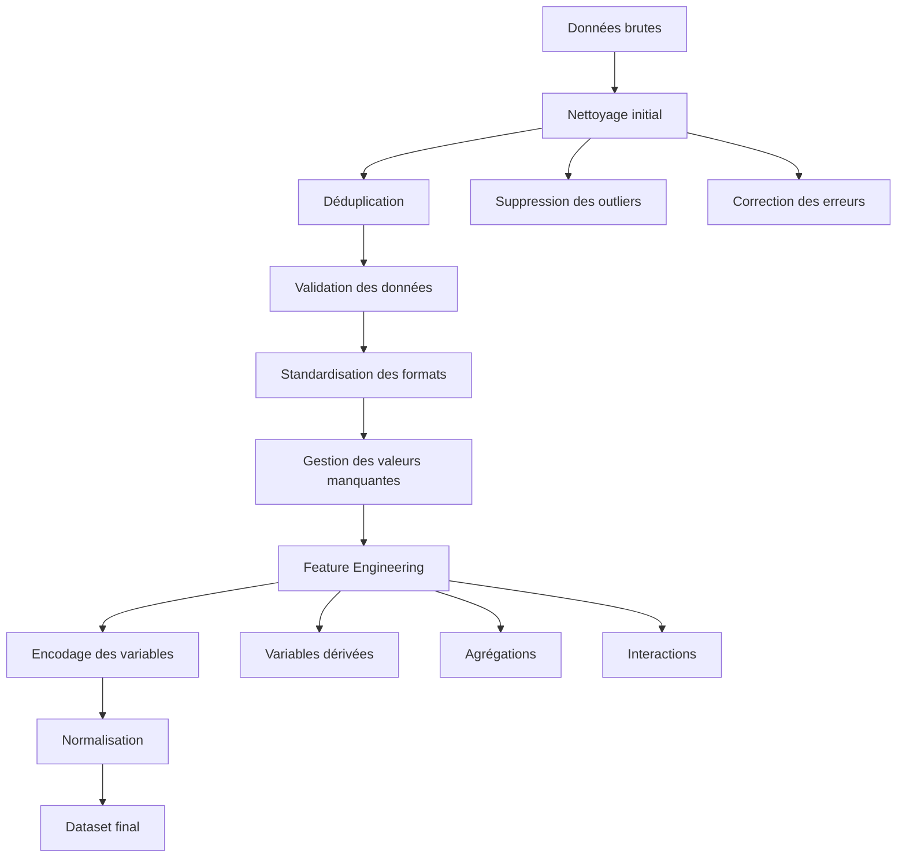

# Preprocessing des données

## Vue d'ensemble

Le preprocessing est une étape cruciale qui transforme les données brutes collectées en un dataset propre et optimisé pour l'entraînement du modèle de machine learning.

## Pipeline de preprocessing



## 1. Nettoyage initial

### Suppression des outliers

```python
import pandas as pd
import numpy as np
from scipy import stats

def remove_outliers(df, columns, method='iqr', threshold=1.5):
    """
    Suppression des outliers basée sur IQR ou Z-score
    
    Parameters:
    - df: DataFrame source
    - columns: liste des colonnes à nettoyer
    - method: 'iqr' ou 'zscore'
    - threshold: seuil de détection
    """
    df_clean = df.copy()
    
    for col in columns:
        if method == 'iqr':
            Q1 = df_clean[col].quantile(0.25)
            Q3 = df_clean[col].quantile(0.75)
            IQR = Q3 - Q1
            
            lower_bound = Q1 - threshold * IQR
            upper_bound = Q3 + threshold * IQR
            
            mask = (df_clean[col] >= lower_bound) & (df_clean[col] <= upper_bound)
            
        elif method == 'zscore':
            z_scores = np.abs(stats.zscore(df_clean[col]))
            mask = z_scores < threshold
        
        df_clean = df_clean[mask]
        
        print(f"{col}: {len(df) - len(df_clean)} outliers supprimés")
    
    return df_clean

# Application sur les données de prix
df_clean = remove_outliers(
    df_raw, 
    columns=['prix', 'kilometrage', 'puissance'],
    method='iqr',
    threshold=2.0
)
```

### Correction des erreurs de saisie

```python
def correct_data_errors(df):
    """Correction des erreurs communes dans les données"""
    
    df_corrected = df.copy()
    
    # Correction des marques (normalisation)
    brand_mapping = {
        'bmw': 'BMW',
        'Bmw': 'BMW',
        'mercedes': 'Mercedes',
        'Mercedes-Benz': 'Mercedes',
        'volkswagen': 'Volkswagen',
        'VW': 'Volkswagen',
        'renault': 'Renault',
        'peugeot': 'Peugeot'
    }
    
    df_corrected['marque'] = df_corrected['marque'].replace(brand_mapping)
    
    # Correction des types de carburant
    fuel_mapping = {
        'diesel': 'Diesel',
        'essence': 'Essence',
        'hybride': 'Hybride',
        'electrique': 'Electrique',
        'electric': 'Electrique',
        'hybrid': 'Hybride'
    }
    
    df_corrected['carburant'] = df_corrected['carburant'].replace(fuel_mapping)
    
    # Correction des incohérences kilométrage/âge
    df_corrected['age_vehicule'] = 2024 - df_corrected['annee']
    
    # Véhicules avec kilométrage impossible (> 50k km/an)
    max_km_realistic = df_corrected['age_vehicule'] * 50000
    mask_realistic_km = df_corrected['kilometrage'] <= max_km_realistic
    
    print(f"Véhicules avec kilométrage irréaliste: {(~mask_realistic_km).sum()}")
    df_corrected = df_corrected[mask_realistic_km]
    
    return df_corrected
```

## 2. Déduplication

### Identification des doublons

```python
def identify_duplicates(df, similarity_threshold=0.9):
    """
    Identification des doublons basée sur la similarité
    des caractéristiques principales
    """
    
    # Colonnes principales pour l'identification
    key_columns = ['marque', 'modele', 'annee', 'carburant', 'puissance']
    
    # Doublons exacts
    exact_duplicates = df.duplicated(subset=key_columns, keep='first')
    print(f"Doublons exacts: {exact_duplicates.sum()}")
    
    # Doublons approximatifs (kilométrage similaire ±2000 km)
    df_no_exact_dups = df[~exact_duplicates].copy()
    
    # Groupage par caractéristiques principales
    grouped = df_no_exact_dups.groupby(key_columns)
    
    approximate_duplicates = []
    
    for name, group in grouped:
        if len(group) > 1:
            # Calcul de la matrice de distance pour le kilométrage
            km_values = group['kilometrage'].values
            km_diff_matrix = np.abs(km_values[:, np.newaxis] - km_values)
            
            # Indices des véhicules avec kilométrage similaire
            similar_pairs = np.where((km_diff_matrix < 2000) & (km_diff_matrix > 0))
            
            if len(similar_pairs[0]) > 0:
                # Garder le véhicule avec le plus de données complètes
                completeness_score = group.notna().sum(axis=1)
                best_idx = completeness_score.idxmax()
                
                # Marquer les autres comme doublons
                duplicates_idx = group.index[group.index != best_idx]
                approximate_duplicates.extend(duplicates_idx)
    
    print(f"Doublons approximatifs: {len(approximate_duplicates)}")
    
    return exact_duplicates, approximate_duplicates

# Suppression des doublons
exact_dups, approx_dups = identify_duplicates(df_corrected)
all_duplicates = exact_dups | df_corrected.index.isin(approx_dups)
df_dedup = df_corrected[~all_duplicates].copy()
```

## 3. Gestion des valeurs manquantes

### Analyse des valeurs manquantes

```python
def analyze_missing_values(df):
    """Analyse détaillée des valeurs manquantes"""
    
    missing_stats = pd.DataFrame({
        'column': df.columns,
        'missing_count': df.isnull().sum(),
        'missing_percentage': (df.isnull().sum() / len(df)) * 100,
        'dtype': df.dtypes
    }).sort_values('missing_percentage', ascending=False)
    
    print("Statistiques des valeurs manquantes:")
    print(missing_stats[missing_stats['missing_count'] > 0])
    
    # Visualisation
    import matplotlib.pyplot as plt
    import seaborn as sns
    
    plt.figure(figsize=(12, 6))
    missing_data = missing_stats[missing_stats['missing_count'] > 0]
    
    sns.barplot(data=missing_data, x='missing_percentage', y='column')
    plt.title('Pourcentage de valeurs manquantes par colonne')
    plt.xlabel('Pourcentage manquant (%)')
    plt.tight_layout()
    plt.show()
    
    return missing_stats

# Stratégies d'imputation
def impute_missing_values(df):
    """Imputation des valeurs manquantes avec différentes stratégies"""
    
    df_imputed = df.copy()
    
    # 1. Variables catégorielles - Mode ou 'Inconnu'
    categorical_columns = ['carburant', 'transmission', 'couleur']
    
    for col in categorical_columns:
        if col in df_imputed.columns:
            if df_imputed[col].isnull().sum() > 0:
                # Si < 5% manquant: mode, sinon 'Inconnu'
                missing_pct = df_imputed[col].isnull().sum() / len(df_imputed)
                
                if missing_pct < 0.05:
                    mode_value = df_imputed[col].mode()[0]
                    df_imputed[col].fillna(mode_value, inplace=True)
                else:
                    df_imputed[col].fillna('Inconnu', inplace=True)
    
    # 2. Variables numériques - Régression ou médiane groupée
    numeric_columns = ['puissance', 'cylindree', 'consommation']
    
    for col in numeric_columns:
        if col in df_imputed.columns and df_imputed[col].isnull().sum() > 0:
            
            # Imputation par médiane groupée (marque + carburant)
            for (marque, carburant), group in df_imputed.groupby(['marque', 'carburant']):
                mask = (df_imputed['marque'] == marque) & \
                       (df_imputed['carburant'] == carburant) & \
                       df_imputed[col].isnull()
                
                if mask.sum() > 0 and group[col].notna().sum() > 0:
                    median_value = group[col].median()
                    df_imputed.loc[mask, col] = median_value
            
            # Imputation restante par médiane globale
            remaining_missing = df_imputed[col].isnull().sum()
            if remaining_missing > 0:
                global_median = df_imputed[col].median()
                df_imputed[col].fillna(global_median, inplace=True)
    
    # 3. Prix neuf - Imputation basée sur le modèle
    if 'prix_neuf' in df_imputed.columns:
        missing_prix_neuf = df_imputed['prix_neuf'].isnull()
        
        if missing_prix_neuf.sum() > 0:
            # Utilisation d'un modèle de régression simple
            from sklearn.ensemble import RandomForestRegressor
            from sklearn.preprocessing import LabelEncoder
            
            # Préparation des données pour l'imputation
            features_for_imputation = ['marque', 'modele', 'annee', 'puissance', 'cylindree']
            
            # Données complètes pour l'entraînement
            train_mask = df_imputed['prix_neuf'].notna()
            X_train = df_imputed[train_mask][features_for_imputation].copy()
            y_train = df_imputed[train_mask]['prix_neuf']
            
            # Encodage des variables catégorielles
            label_encoders = {}
            for col in ['marque', 'modele']:
                le = LabelEncoder()
                X_train[col] = le.fit_transform(X_train[col].astype(str))
                label_encoders[col] = le
            
            # Entraînement du modèle d'imputation
            imputation_model = RandomForestRegressor(n_estimators=100, random_state=42)
            imputation_model.fit(X_train, y_train)
            
            # Prédiction pour les valeurs manquantes
            X_missing = df_imputed[missing_prix_neuf][features_for_imputation].copy()
            
            for col in ['marque', 'modele']:
                # Gestion des nouvelles catégories
                le = label_encoders[col]
                X_missing[col] = X_missing[col].astype(str)
                
                # Encodage avec gestion des valeurs inconnues
                unknown_mask = ~X_missing[col].isin(le.classes_)
                X_missing.loc[unknown_mask, col] = le.classes_[0]  # Valeur par défaut
                X_missing[col] = le.transform(X_missing[col])
            
            # Prédiction
            predicted_prices = imputation_model.predict(X_missing)
            df_imputed.loc[missing_prix_neuf, 'prix_neuf'] = predicted_prices
    
    return df_imputed
```

## 4. Feature Engineering

### Création de variables dérivées

```python
def create_derived_features(df):
    """Création de nouvelles variables à partir des existantes"""
    
    df_features = df.copy()
    
    # 1. Variables temporelles
    df_features['age_vehicule'] = 2024 - df_features['annee']
    df_features['km_par_an'] = df_features['kilometrage'] / df_features['age_vehicule']
    
    # Gestion division par zéro (véhicules neufs)
    df_features['km_par_an'] = df_features['km_par_an'].replace([np.inf, -np.inf], df_features['kilometrage'])
    
    # 2. Variables de performance
    df_features['puissance_specifique'] = df_features['puissance'] / df_features['cylindree'] * 1000
    df_features['ratio_puissance_poids'] = df_features['puissance'] / 1500  # Poids moyen estimé
    
    # 3. Segmentation véhicule
    def categorize_vehicle_segment(row):
        prix_neuf = row['prix_neuf']
        puissance = row['puissance']
        
        if prix_neuf < 20000:
            return 'Economique'
        elif prix_neuf < 35000:
            if puissance > 200:
                return 'Sportif'
            else:
                return 'Compact'
        elif prix_neuf < 50000:
            return 'Familial'
        else:
            return 'Premium'
    
    df_features['segment'] = df_features.apply(categorize_vehicle_segment, axis=1)
    
    # 4. Variables de marché
    # Popularité de la marque (fréquence dans le dataset)
    brand_counts = df_features['marque'].value_counts()
    df_features['popularite_marque'] = df_features['marque'].map(brand_counts)
    
    # Prix moyen de la marque
    brand_avg_price = df_features.groupby('marque')['prix_neuf'].mean()
    df_features['prix_moyen_marque'] = df_features['marque'].map(brand_avg_price)
    
    # 5. Variables d'usage
    def categorize_usage(km_per_year):
        if km_per_year < 10000:
            return 'Faible'
        elif km_per_year < 20000:
            return 'Normal'
        elif km_per_year < 30000:
            return 'Intensif'
        else:
            return 'Très_intensif'
    
    df_features['usage_intensite'] = df_features['km_par_an'].apply(categorize_usage)
    
    # 6. Interactions importantes
    df_features['age_x_km'] = df_features['age_vehicule'] * df_features['kilometrage']
    df_features['puissance_x_age'] = df_features['puissance'] * df_features['age_vehicule']
    
    # 7. Variables cycliques (pour l'âge)
    df_features['age_sin'] = np.sin(2 * np.pi * df_features['age_vehicule'] / 20)  # Cycle 20 ans
    df_features['age_cos'] = np.cos(2 * np.pi * df_features['age_vehicule'] / 20)
    
    return df_features

# Application du feature engineering
df_with_features = create_derived_features(df_imputed)
```

### Variables de contexte économique

```python
def add_economic_context(df):
    """Ajout de variables de contexte économique"""
    
    # Indices économiques par année (données simulées - à remplacer par de vraies données)
    economic_indices = {
        2017: {'inflation': 1.0, 'pib_growth': 2.3, 'unemployment': 9.4},
        2018: {'inflation': 2.1, 'pib_growth': 1.8, 'unemployment': 9.1},
        2019: {'inflation': 1.1, 'pib_growth': 1.5, 'unemployment': 8.5},
        2020: {'inflation': 0.5, 'pib_growth': -7.9, 'unemployment': 8.0},
        2021: {'inflation': 1.6, 'pib_growth': 7.0, 'unemployment': 7.9},
        2022: {'inflation': 5.2, 'pib_growth': 2.6, 'unemployment': 7.3},
        2023: {'inflation': 4.9, 'pib_growth': 0.9, 'unemployment': 7.2},
        2024: {'inflation': 2.3, 'pib_growth': 1.3, 'unemployment': 7.5}
    }
    
    df_context = df.copy()
    
    # Ajout des indices économiques
    for year, indices in economic_indices.items():
        mask = df_context['annee'] == year
        for indicator, value in indices.items():
            df_context.loc[mask, f'{indicator}_annee_achat'] = value
    
    # Variables de saisonnalité (si date de collecte disponible)
    if 'date_collecte' in df_context.columns:
        df_context['mois_collecte'] = pd.to_datetime(df_context['date_collecte']).dt.month
        df_context['trimestre_collecte'] = pd.to_datetime(df_context['date_collecte']).dt.quarter
        
        # Saisonnalité automobile (les ventes varient selon les mois)
        seasonal_factors = {
            1: 0.85, 2: 0.88, 3: 1.05, 4: 1.02,  # Q1
            5: 1.08, 6: 1.12, 7: 0.95, 8: 0.92,  # Q2-Q3
            9: 1.15, 10: 1.18, 11: 1.03, 12: 0.97  # Q4
        }
        
        df_context['facteur_saisonnier'] = df_context['mois_collecte'].map(seasonal_factors)
    
    return df_context
```

## 5. Encodage des variables

### Encodage des variables catégorielles

```python
from sklearn.preprocessing import LabelEncoder, OneHotEncoder
import category_encoders as ce

def encode_categorical_variables(df, target_column='taux_decote'):
    """Encodage optimisé des variables catégorielles"""
    
    df_encoded = df.copy()
    
    # 1. Variables avec peu de modalités - One-Hot Encoding
    low_cardinality_cols = ['carburant', 'transmission', 'segment', 'usage_intensite']
    
    for col in low_cardinality_cols:
        if col in df_encoded.columns:
            n_categories = df_encoded[col].nunique()
            
            if n_categories <= 10:  # Seuil pour One-Hot
                # One-Hot Encoding avec préfixe
                dummies = pd.get_dummies(df_encoded[col], prefix=col)
                df_encoded = pd.concat([df_encoded, dummies], axis=1)
                df_encoded.drop(col, axis=1, inplace=True)
    
    # 2. Variables avec beaucoup de modalités - Target Encoding
    high_cardinality_cols = ['marque', 'modele']
    
    for col in high_cardinality_cols:
        if col in df_encoded.columns:
            n_categories = df_encoded[col].nunique()
            
            if n_categories > 10:
                # Target Encoding (moyenne du target par catégorie)
                target_encoder = ce.TargetEncoder(cols=[col])
                
                # Éviter le data leakage avec validation croisée
                from sklearn.model_selection import KFold
                
                kf = KFold(n_splits=5, shuffle=True, random_state=42)
                encoded_values = np.zeros(len(df_encoded))
                
                for train_idx, val_idx in kf.split(df_encoded):
                    # Entraînement sur le fold de train
                    encoder_fold = ce.TargetEncoder(cols=[col])
                    encoder_fold.fit(df_encoded.iloc[train_idx][[col]], 
                                   df_encoded.iloc[train_idx][target_column])
                    
                    # Transformation du fold de validation
                    encoded_val = encoder_fold.transform(df_encoded.iloc[val_idx][[col]])
                    encoded_values[val_idx] = encoded_val[col].values
                
                # Remplacement de la colonne originale
                df_encoded[f'{col}_encoded'] = encoded_values
                df_encoded.drop(col, axis=1, inplace=True)
    
    # 3. Variables ordinales - Label Encoding ordonné
    ordinal_mappings = {
        'etat_vehicule': {'Excellent': 4, 'Très bon': 3, 'Bon': 2, 'Correct': 1, 'Mauvais': 0}
    }
    
    for col, mapping in ordinal_mappings.items():
        if col in df_encoded.columns:
            df_encoded[col] = df_encoded[col].map(mapping)
    
    return df_encoded

# Sauvegarde des encodeurs pour la production
def save_encoders(encoders, filepath='models/encoders.joblib'):
    """Sauvegarde des encodeurs pour utilisation en production"""
    import joblib
    joblib.dump(encoders, filepath)
    print(f"Encodeurs sauvegardés dans {filepath}")
```

## 6. Pipeline de preprocessing complet

```python
from sklearn.pipeline import Pipeline
from sklearn.compose import ColumnTransformer
from sklearn.preprocessing import StandardScaler, RobustScaler

def create_preprocessing_pipeline():
    """Création du pipeline de preprocessing complet"""
    
    # Identification des types de colonnes
    numeric_features = [
        'kilometrage', 'puissance', 'cylindree', 'age_vehicule', 
        'km_par_an', 'puissance_specifique', 'popularite_marque'
    ]
    
    categorical_features = [
        'carburant', 'transmission', 'segment', 'usage_intensite'
    ]
    
    high_cardinality_features = ['marque_encoded', 'modele_encoded']
    
    # Transformateurs pour chaque type
    numeric_transformer = Pipeline(steps=[
        ('scaler', RobustScaler())  # Robuste aux outliers
    ])
    
    categorical_transformer = Pipeline(steps=[
        ('onehot', OneHotEncoder(drop='first', sparse=False, handle_unknown='ignore'))
    ])
    
    # Pipeline principal
    preprocessor = ColumnTransformer(
        transformers=[
            ('num', numeric_transformer, numeric_features),
            ('cat', categorical_transformer, categorical_features),
            ('high_card', 'passthrough', high_cardinality_features)
        ],
        remainder='drop'  # Supprime les colonnes non spécifiées
    )
    
    return preprocessor

# Application du pipeline
def apply_complete_preprocessing(df_raw):
    """Application complète du preprocessing"""
    
    print("1. Nettoyage initial...")
    df_clean = correct_data_errors(df_raw)
    df_clean = remove_outliers(df_clean, ['prix', 'kilometrage', 'puissance'])
    
    print("2. Déduplication...")
    exact_dups, approx_dups = identify_duplicates(df_clean)
    all_duplicates = exact_dups | df_clean.index.isin(approx_dups)
    df_dedup = df_clean[~all_duplicates].copy()
    
    print("3. Gestion des valeurs manquantes...")
    df_imputed = impute_missing_values(df_dedup)
    
    print("4. Feature engineering...")
    df_features = create_derived_features(df_imputed)
    df_features = add_economic_context(df_features)
    
    print("5. Calcul de la variable cible...")
    df_features['taux_decote'] = df_features['prix'] / df_features['prix_neuf']
    
    print("6. Encodage des variables...")
    df_encoded = encode_categorical_variables(df_features)
    
    print("7. Validation finale...")
    # Suppression des lignes avec des valeurs impossibles
    valid_mask = (
        (df_encoded['taux_decote'] > 0.1) & 
        (df_encoded['taux_decote'] < 1.0) &
        (df_encoded['age_vehicule'] >= 0) &
        (df_encoded['kilometrage'] >= 0)
    )
    
    df_final = df_encoded[valid_mask].copy()
    
    print(f"Dataset final: {len(df_final)} véhicules")
    print(f"Réduction: {len(df_raw) - len(df_final)} véhicules supprimés ({(len(df_raw) - len(df_final))/len(df_raw)*100:.1f}%)")
    
    return df_final

# Sauvegarde du dataset preprocessé
def save_processed_data(df, filepath='data/processed_data/preprocessed_data.csv'):
    """Sauvegarde du dataset preprocessé"""
    df.to_csv(filepath, index=False)
    print(f"Dataset sauvegardé: {filepath}")
    
    # Statistiques résumées
    print("\nStatistiques du dataset final:")
    print(f"- Nombre de véhicules: {len(df):,}")
    print(f"- Variables: {len(df.columns)}")
    print(f"- Taux de décote moyen: {df['taux_decote'].mean():.3f}")
    print(f"- Écart-type: {df['taux_decote'].std():.3f}")
```

Ce pipeline de preprocessing garantit la qualité et la cohérence des données pour l'entraînement du modèle, tout en préservant l'information utile et en créant des variables pertinentes pour la prédiction de la valeur résiduelle.