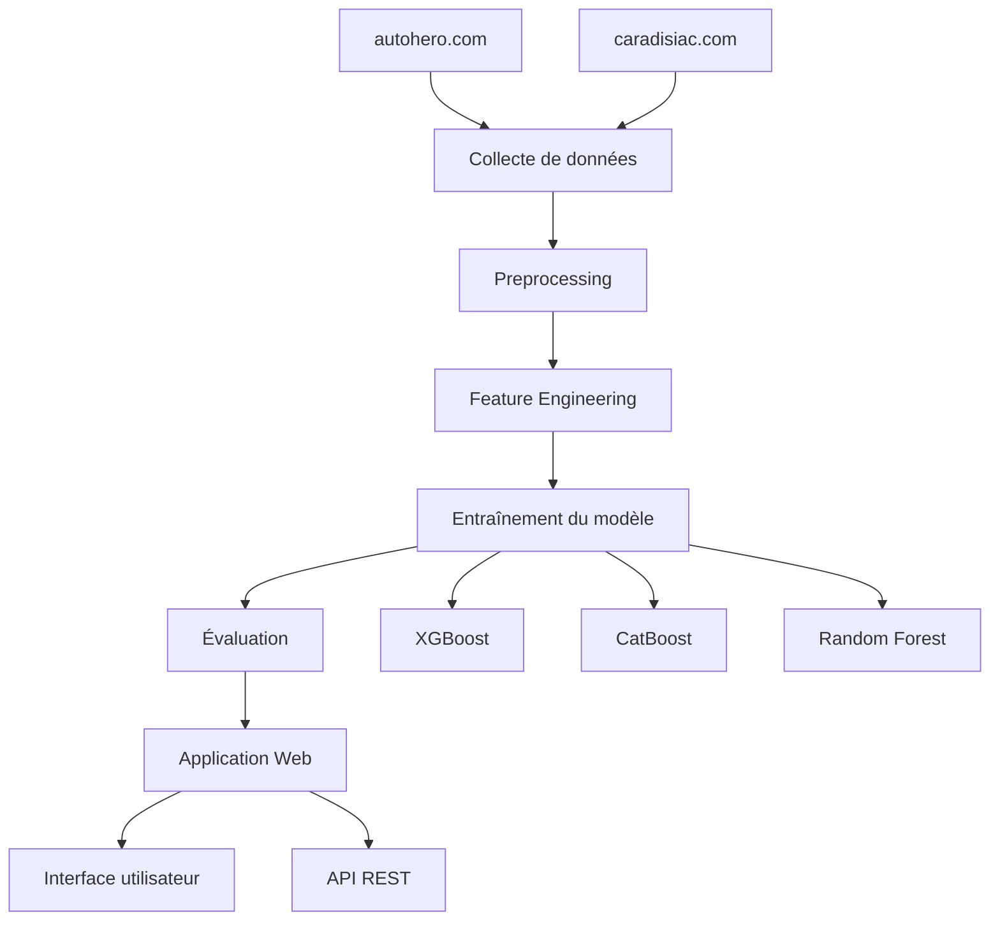
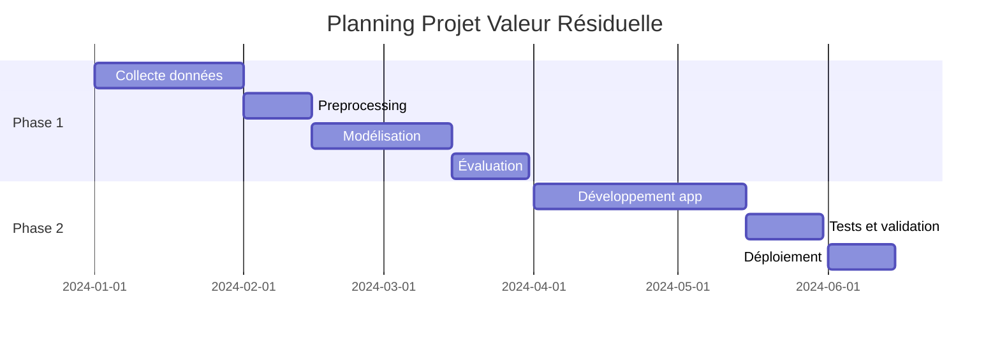

# Vue d'ensemble du projet

## Contexte et objectifs

Le projet **Valeur Résiduelle** vise à développer une solution complète pour l'estimation automatisée des prix de véhicules d'occasion et de leur courbe de décote.

### Problématique

- **Besoin** : Estimation précise de la valeur résiduelle des véhicules
- **Défis** : Multitude de facteurs influençant le prix (marque, modèle, année, kilométrage, état, etc.)
- **Solution** : Modèle de machine learning basé sur des données réelles du marché

## Architecture du projet

## Méthodologie

### 1. Collecte des données
- **Source 1** : Annonces véhicules d'occasion (autohero.com)
- **Source 2** : Fiches techniques et prix neufs (caradisiac.com)
- **Critères de sélection** :
  - Année de mise en circulation ≥ 2017
  - Kilométrage ≤ 100 000 km

### 2. Preprocessing et feature engineering
- Nettoyage des données manquantes
- Standardisation des formats
- Création de variables dérivées
- Encodage des variables catégorielles

### 3. Modélisation
- **Variable cible** : Taux de décote = Prix occasion / Prix neuf
- **Algorithmes testés** : XGBoost, CatBoost, Random Forest
- **Validation** : Cross-validation et jeu de test

### 4. Déploiement
- Application web interactive avec Dash
- API REST pour intégration
- Interface utilisateur intuitive

## Livrables

### Phase 1 - Modèle ML
- [x] Dataset nettoyé et préprocessé
- [x] Modèles entraînés et évalués
- [x] Pipeline de preprocessing
- [x] Métriques de performance

### Phase 2 - Application
- [x] Interface web fonctionnelle
- [x] API REST documentée
- [ ] Tests automatisés
- [ ] Documentation complète

## Équipe et responsabilités

| Rôle | Responsabilité |
|------|----------------|
| Data Scientist | Modélisation et feature engineering |
| Data Engineer | Pipeline de données et preprocessing |
| Développeur Web | Application et interface utilisateur |
| DevOps | Déploiement et infrastructure |

## Planning

